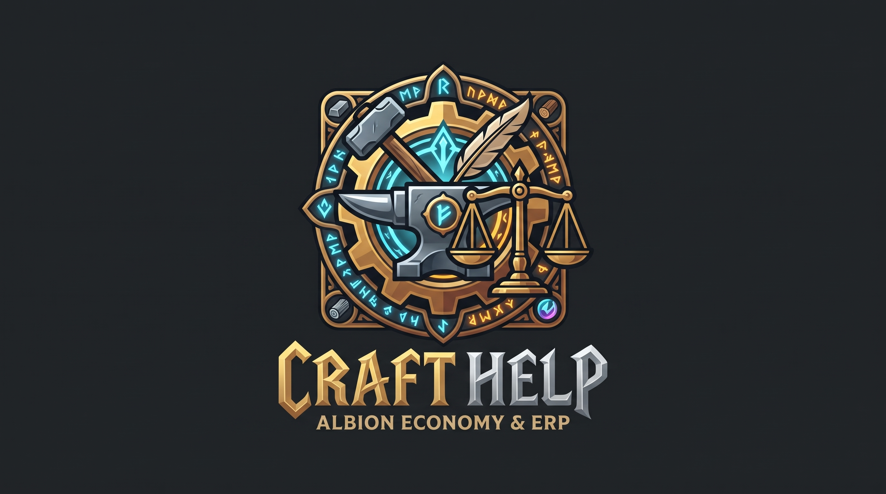

<div align="center">
  <picture>
    <source media="(prefers-color-scheme: dark)" srcset="icons/logo.png">
    
  </picture>


  <h1>CraftHelp</h1>
  <p>A native desktop environment for Albion Online economy planning.</p>

  <a href="https://github.com/ScarlettTheBrave/Craft-Helper/releases"></a>
  <a href="https://python.org"></a>
  <a href="https://pyside.org"></a>
  <a href="https://supabase.com"></a>
  <a href="LICENSE"></a>
</div>

<br>

<details>
  <summary><b>🇷🇺 Читать на русском (Russian Version)</b></summary>
  <br>
  
  Экономика Альбиона выстроена так, что ты либо считаешь каждую копейку налога, либо крафтишь в минус. 
  
  CraftHelp это десктопный клиент для управления крафтом и переработкой. Никаких Google Таблиц. Приложение считает реальную себестоимость с учетом станков, возврата ресурсов, заполнения журналов и расхода фокуса. 

  Тут есть движок замен. Программа сама парсит рыночные данные и смотрит, что выгоднее купить для крафта. Если токен (допустим Crystallized Dread) сейчас на аукционе стоит дешевле самого артефакта, калькулятор молча подставит в смету именно токен. 

  Режим ERP позволяет собрать целую корзину из десятков разных предметов. На выходе получается единый список нужного сырья, а сам профиль закупки улетает в облако Supabase.

  Работает полностью автономно на клиенте. Не нужно поднимать докеры или локальные базы данных.
</details>

<br>

The fast, autonomous and precise way to calculate Albion Online crafting margins. A native Python application based on the PySide6 framework, CraftHelp is well-suited for both simple item checks and massive ERP production planning.

<div align="center">
  
</div>

CraftHelp is in use in production and includes a number of features and performance optimizations we've added along the way. Among those is a high-performance substitution engine, built-in cloud synchronization, declarative UI views, and more.

To get started, see the tutorial below, the source code, and some common resources.

> [!TIP]
> Upgrading from v1? Check out the new Supabase integration or point your profile manager at the cloud.

## The Problem

Crafting in Albion Online relies entirely on spreadsheets. Most players end up building massive, fragile Excel files that break the moment a recipe changes or a new resource tier drops. 

CraftHelp replaces that mess. It calculates your exact margins before you buy a single piece of raw material. It factors in everything from the current station tax and your Resource Return Rate down to the exact profit you get from filling laborer journals during the craft.

It also runs entirely on your machine. You don't need to spin up a local PostgreSQL instance or configure Docker containers just to check leather prices. The heavy logic is client-side and the data syncs through a lightweight REST API to Supabase.

## Smart Token Substitution

Market prices for raw artifacts fluctuate wildly. Sometimes buying the raw artifact is cheaper. Sometimes buying the corresponding exchange token and rolling it at the artifact foundry saves you hundreds of thousands of silver.

You don't need to check this manually anymore. The application queries the Albion Data Project for both the artifact and its token counterpart. Whichever is cheaper gets automatically injected into your crafting estimate.

## Project Structure

If you want to poke around the codebase, here is how things are organized.

The math happens inside `calc_engine.py` and `journal_engine.py`. These files contain the raw formulas for tax calculations and evaluating which laborer journal tier actually yields the highest net profit.

```python
# Mathematical core for calculating true item costs
# Taxes, RRR, and journal margins are processed here
from core import calc_engine
from core import journal_engine
```

The user interface is built with PySide6 in `ui_new.py`. Since pulling massive JSON payloads from market APIs can freeze a desktop app, all network requests and heavy calculations are offloaded to background threads using `QThreadPool`.

```python
# UI threading implementation
# Prevents desktop application from freezing during API calls
pool = QThreadPool.globalInstance()
pool.start(MarketApiWorker())
```

Network calls to the Albion Data Project are batched in `market_api.py`. Cloud saves for your ERP profiles are handled by `storage.py` connecting directly to Supabase. 

We also have a script called `fix_mats.py`. It cleans up the raw game data files by stripping out uncraftable items and junk NPC vendor recipes.

## Getting Started

You need Python 3.12 or higher. Clone the repository and set up a clean virtual environment so you don't pollute your global packages.


```bash
git clone https://github.com/ScarlettTheBrave/Craft-Helper.git
cd Craft-Helper
python -m venv venv
```

Activate the environment. On Windows run

```bash
venv\Scripts\activate
```

On macOS or Linux run

```bash
source venv/bin/activate
```


Install the required libraries and start the application.

```bash
pip install -r requirements.txt
python ui_new.py
```


> [!IMPORTANT]
> The application needs to know where to save your profiles. Look in the root folder for a file named `.env.example`. Rename it to `.env` and open it in any text editor. Drop your Supabase credentials in there.

## Compiling for Windows

If you don't want to run the python script every time, you can package the whole thing into a standalone executable using PyInstaller.

```bash
pyinstaller --noconsole --name "CraftHelp" --add-data "theme.qss;." ui_new.py
```

This will create a `dist` folder. Grab your `.env` file and the `icons_cache` directory and drop them right next to the new `CraftHelp.exe` file.
